El esquema separa datos sincronizados desde el TEC, datos propios del usuario,
contenido comunitario moderado y metadatos operativos. Esta separación permite
actualizar catálogos oficiales sin borrar historial personal, horarios guardados,
evaluaciones o reseñas que ya referencian filas antiguas.

## Diagrama entidad-relación

El diagrama resume las tablas principales del estado actual de migraciones. No
incluye todas las tablas internas de Better Auth, pero sí muestra las que definen
el contrato de la app.

```mermaid
erDiagram
  BETTER_AUTH_USER ||--|| USER_PROFILE : perfil_app
  BETTER_AUTH_USER ||--o{ BETTER_AUTH_SESSION : inicia
  BETTER_AUTH_USER ||--o{ BETTER_AUTH_ACCOUNT : vincula
  BETTER_AUTH_USER ||--o{ COURSE_EVALUATIONS : modera

  COUNTRY ||--o{ UNIVERSITY : contiene
  UNIVERSITY ||--o{ CAMPUS : tiene
  UNIVERSITY ||--o{ ACADEMIC_UNIT : organiza

  ACADEMIC_UNIT ||--o{ ACADEMIC_UNIT_CAMPUS : ofrece
  CAMPUS ||--o{ ACADEMIC_UNIT_CAMPUS : aloja

  ACADEMIC_MODALITY ||--o{ ACADEMIC_TERM : define
  ACADEMIC_MODALITY ||--o{ STUDY_PLAN : clasifica

  ACADEMIC_UNIT ||--o{ STUDY_PLAN : administra
  STUDY_PLAN ||--o{ STUDY_PLAN_CAMPUS : disponible_en
  CAMPUS ||--o{ STUDY_PLAN_CAMPUS : habilita

  STUDY_PLAN ||--o{ STUDY_PLAN_LEVEL : estructura
  STUDY_PLAN_LEVEL ||--o{ STUDY_PLAN_LEVEL_COURSE : agrupa
  COURSE ||--o{ STUDY_PLAN_LEVEL_COURSE : aparece_en

  STUDY_PLAN ||--o{ COURSE_RELATION : define
  COURSE ||--o{ COURSE_RELATION : origen
  COURSE ||--o{ COURSE_RELATION : destino

  COURSE ||--o{ COURSE_OFFERING : se_oferta
  CAMPUS ||--o{ COURSE_OFFERING : sede
  ACADEMIC_UNIT ||--o{ COURSE_OFFERING : unidad
  ACADEMIC_TERM ||--o{ COURSE_OFFERING : periodo
  COURSE_OFFERING ||--o{ COURSE_OFFERING_GROUP : contiene
  COURSE_OFFERING_GROUP ||--o{ COURSE_OFFERING_GROUP_PROFESSOR : asigna
  PROFESSOR ||--o{ COURSE_OFFERING_GROUP_PROFESSOR : imparte
  COURSE_OFFERING_GROUP ||--o{ COURSE_OFFERING_MEETING : programa

  USER_PROFILE ||--o{ USER_ROLE : posee
  USER_PROFILE ||--o{ USER_STUDY_PLAN : cursa
  STUDY_PLAN ||--o{ USER_STUDY_PLAN : elegido
  CAMPUS ||--o{ USER_STUDY_PLAN : inscrito_en

  USER_PROFILE ||--o{ STUDENT_COURSE_RECORD : registra
  STUDY_PLAN ||--o{ STUDENT_COURSE_RECORD : contextualiza
  COURSE ||--o{ STUDENT_COURSE_RECORD : curso
  ACADEMIC_TERM ||--o{ STUDENT_COURSE_RECORD : periodo

  USER_PROFILE ||--o{ SAVED_SCHEDULE : guarda
  ACADEMIC_TERM ||--o{ SAVED_SCHEDULE : corresponde_a
  SAVED_SCHEDULE ||--o{ SAVED_SCHEDULE_ITEM : contiene
  COURSE_OFFERING_GROUP ||--o{ SAVED_SCHEDULE_ITEM : seleccionado

  PROFESSOR ||--o{ PROFESSOR_REVIEW : recibe
  COURSE ||--o{ PROFESSOR_REVIEW : contexto
  ACADEMIC_TERM ||--o{ PROFESSOR_REVIEW : periodo
  USER_PROFILE ||--o{ PROFESSOR_REVIEW : revisa
  PROFESSOR_REVIEW ||--o{ PROFESSOR_REVIEW_REACTION : reacciona
  USER_PROFILE ||--o{ PROFESSOR_REVIEW_REACTION : emite
  PROFESSOR_REVIEW ||--o{ PROFESSOR_REVIEW_REPORT : reporta
  USER_PROFILE ||--o{ PROFESSOR_REVIEW_REPORT : resuelve

  COURSE ||--o{ COURSE_EVALUATIONS : documenta
  ACADEMIC_TERM ||--o{ COURSE_EVALUATIONS : periodo
  PROFESSOR ||--o{ COURSE_EVALUATIONS : asociado

  BETTER_AUTH_USER {
    TEXT id PK
    TEXT email UK
    TEXT name
    BOOLEAN emailVerified
    TIMESTAMPTZ createdAt
    TIMESTAMPTZ updatedAt
  }

  BETTER_AUTH_SESSION {
    TEXT id PK
    TEXT userId FK
    TEXT token UK
    TIMESTAMPTZ expiresAt
  }

  BETTER_AUTH_ACCOUNT {
    TEXT id PK
    TEXT userId FK
    TEXT providerId
    TEXT accountId
  }

  USER_PROFILE {
    UUID id PK
    TEXT carnet UK
    TIMESTAMPTZ onboarding_dismissed_at
    TIMESTAMPTZ onboarding_completed_at
    TIMESTAMPTZ created_at
    TIMESTAMPTZ updated_at
  }

  COUNTRY {
    BIGSERIAL id PK
    TEXT name
    CHAR iso2_code UK
    BOOLEAN is_active
    TIMESTAMPTZ deactivated_at
  }

  UNIVERSITY {
    BIGSERIAL id PK
    BIGINT country_id FK
    TEXT name
    TEXT short_name
    BOOLEAN is_active
    TIMESTAMPTZ deactivated_at
  }

  CAMPUS {
    BIGSERIAL id PK
    BIGINT university_id FK
    TEXT code UK
    TEXT name
    BOOLEAN is_active
    TIMESTAMPTZ deactivated_at
  }

  ACADEMIC_UNIT {
    BIGSERIAL id PK
    BIGINT university_id FK
    TEXT code UK
    TEXT name
    BOOLEAN is_active
    TIMESTAMPTZ deactivated_at
  }

  ACADEMIC_UNIT_CAMPUS {
    BIGSERIAL id PK
    BIGINT academic_unit_id FK
    BIGINT campus_id FK
    BOOLEAN is_active
    TIMESTAMPTZ deactivated_at
  }

  ACADEMIC_MODALITY {
    BIGSERIAL id PK
    TEXT code UK
    TEXT name
    INT periods_per_year
    BOOLEAN is_active
    TIMESTAMPTZ deactivated_at
  }

  ACADEMIC_TERM {
    BIGSERIAL id PK
    BIGINT academic_modality_id FK
    INT year
    INT period_number
    TEXT external_key UK
    TEXT display_name
    DATE starts_on
    DATE ends_on
    BOOLEAN is_active
    TIMESTAMPTZ deactivated_at
  }

  STUDY_PLAN {
    BIGSERIAL id PK
    BIGINT academic_unit_id FK
    BIGINT academic_modality_id FK
    INT external_plan_id
    TEXT name
    TEXT academic_degree
    INT first_level_number
    BOOLEAN is_active
    TIMESTAMPTZ deactivated_at
  }

  STUDY_PLAN_CAMPUS {
    BIGSERIAL id PK
    BIGINT study_plan_id FK
    BIGINT campus_id FK
    DATE valid_from
    DATE valid_to
    BOOLEAN is_active
    TIMESTAMPTZ deactivated_at
  }

  STUDY_PLAN_LEVEL {
    BIGSERIAL id PK
    BIGINT study_plan_id FK
    INT level_number
    TEXT level_label
    BOOLEAN is_active
    TIMESTAMPTZ deactivated_at
  }

  COURSE {
    BIGSERIAL id PK
    TEXT code UK
    TEXT name
    INT default_credits
    INT default_weekly_hours
    BOOLEAN is_active
    TIMESTAMPTZ deactivated_at
  }

  STUDY_PLAN_LEVEL_COURSE {
    BIGSERIAL id PK
    BIGINT study_plan_level_id FK
    BIGINT course_id FK
    INT credits
    INT weekly_hours
    INT sort_order
    BOOLEAN is_active
    TIMESTAMPTZ deactivated_at
  }

  COURSE_RELATION {
    BIGSERIAL id PK
    BIGINT study_plan_id FK
    BIGINT from_course_id FK
    BIGINT to_course_id FK
    course_relation_type relation_type
    BOOLEAN is_active
    TIMESTAMPTZ deactivated_at
  }

  PROFESSOR {
    BIGSERIAL id PK
    TEXT full_name UK
    BOOLEAN is_active
    TIMESTAMPTZ deactivated_at
  }

  COURSE_OFFERING {
    BIGSERIAL id PK
    BIGINT course_id FK
    BIGINT campus_id FK
    BIGINT academic_unit_id FK
    BIGINT academic_term_id FK
    INT credits_snapshot
    INT weekly_hours_snapshot
    TEXT course_type
    BOOLEAN is_active
    TIMESTAMPTZ deactivated_at
  }

  COURSE_OFFERING_GROUP {
    BIGSERIAL id PK
    BIGINT course_offering_id FK
    TEXT group_code
    group_type group_type
    INT capacity
    BOOLEAN is_active
    TIMESTAMPTZ deactivated_at
  }

  COURSE_OFFERING_GROUP_PROFESSOR {
    BIGSERIAL id PK
    BIGINT course_offering_group_id FK
    BIGINT professor_id FK
    BOOLEAN is_active
    TIMESTAMPTZ deactivated_at
  }

  COURSE_OFFERING_MEETING {
    BIGSERIAL id PK
    BIGINT course_offering_group_id FK
    INT weekday
    TIME starts_at
    TIME ends_at
    TEXT classroom
    BOOLEAN is_active
    TIMESTAMPTZ deactivated_at
  }

  USER_ROLE {
    BIGSERIAL id PK
    UUID user_id FK
    app_role role
    TIMESTAMPTZ created_at
  }

  USER_STUDY_PLAN {
    BIGSERIAL id PK
    UUID user_id FK
    BIGINT study_plan_id FK
    BIGINT campus_id FK
    INT entry_year
    DATE started_on
    DATE ended_on
    BOOLEAN is_active
  }

  STUDENT_COURSE_RECORD {
    BIGSERIAL id PK
    UUID user_id FK
    BIGINT study_plan_id FK
    BIGINT course_id FK
    BIGINT academic_term_id FK
    student_course_status status
    NUMERIC grade
    BOOLEAN approved
    INT attempt_number
  }

  SAVED_SCHEDULE {
    BIGSERIAL id PK
    UUID user_id FK
    TEXT name
    BIGINT academic_term_id FK
    TIMESTAMPTZ created_at
    TIMESTAMPTZ updated_at
  }

  SAVED_SCHEDULE_ITEM {
    BIGSERIAL id PK
    BIGINT saved_schedule_id FK
    BIGINT course_offering_group_id FK
    TIMESTAMPTZ created_at
  }

  PROFESSOR_REVIEW {
    BIGSERIAL id PK
    BIGINT professor_id FK
    BIGINT course_id FK
    BIGINT academic_term_id FK
    TEXT course_code_snapshot
    TEXT course_name_snapshot
    TEXT comment
    INT ease_score
    INT quality_score
    INT clarity_score
    INT fairness_score
    BOOLEAN attendance_required
    TEXT engagement_level
    TEXT[] tags
    professor_review_status status
    UUID reviewed_by FK
    TIMESTAMPTZ reviewed_at
  }

  PROFESSOR_REVIEW_REACTION {
    BIGSERIAL id PK
    BIGINT review_id FK
    UUID user_id FK
    TEXT reaction
    TIMESTAMPTZ created_at
    TIMESTAMPTZ updated_at
  }

  PROFESSOR_REVIEW_REPORT {
    BIGSERIAL id PK
    BIGINT review_id FK
    TEXT reason
    TEXT description
    professor_review_report_status status
    UUID resolved_by FK
    TIMESTAMPTZ resolved_at
  }

  COURSE_EVALUATIONS {
    BIGSERIAL id PK
    BIGINT course_id FK
    BIGINT academic_term_id FK
    BIGINT professor_id FK
    evaluation_type evaluation_type
    INT evaluation_number
    TEXT custom_name
    BOOLEAN is_catedra
    BOOLEAN includes_answers
    BOOLEAN has_separate_answers
    TEXT file_key
    TEXT file_sha256
    TEXT answers_file_key
    evaluation_status status
    TEXT moderation_note
    UUID moderated_by FK
  }

  SYNC_SEED_RUN {
    BIGINT id PK
    TEXT seed_file_name
    TEXT seed_sha256 UK
    TEXT scope
    INTEGER[] years
    TEXT[] term_external_keys
    TEXT status
    JSONB metadata
    TIMESTAMPTZ generated_at_utc
    TIMESTAMPTZ applied_at_utc
  }
```

## Dominios del esquema

### Datos sincronizados del TEC

Las tablas de catálogo y oferta son administradas por `supabase/tec-data`. Usan
llaves naturales para upsert y columnas de lifecycle (`is_active`, `updated_at`,
`deactivated_at`) para evitar borrados físicos. El sync remapea IDs contra la
base destino antes de generar deltas, por lo que el ID es una PK interna y la
llave natural es el contrato de sincronización.

Las entidades base son `country`, `university`, `campus`, `academic_unit`,
`academic_unit_campus`, `academic_modality`, `academic_term`, `study_plan`,
`study_plan_campus`, `study_plan_level`, `course`, `study_plan_level_course` y
`course_relation`. La oferta concreta de periodos vive en `professor`,
`course_offering`, `course_offering_group`, `course_offering_group_professor` y
`course_offering_meeting`.

### Usuario y autenticación

Better Auth administra identidad en el schema `better_auth`. La app mantiene su
perfil propio en `public."user"`, referenciado por UUID al usuario de Better Auth
y limitado a datos específicos de la aplicación: carnet y estado de onboarding.

`user_role` guarda roles internos como `admin`. `user_study_plan`,
`student_course_record`, `saved_schedule` y `saved_schedule_item` modelan el
contexto académico personal, progreso y horarios guardados.

### Contenido comunitario

Las reseñas de profesores viven en `professor_review` con estado de moderación,
scores separados, tags y contexto de curso/periodo. Las reacciones y reportes se
separan en `professor_review_reaction` y `professor_review_report`.

Las evaluaciones subidas por usuarios se guardan en `course_evaluations`. Desde
la carga anónima ya no existe `uploaded_by`; la moderación se representa con
`moderated_by`, `moderated_at`, `status` y `moderation_note`. `course_id` y
`academic_term_id` son `BIGINT` para alinearse con las tablas académicas.

### Operación de sync

`sync_seed_run` registra el lifecycle de seeds generados/aplicados por `tec-data`:
archivo, SHA256, scope, años, términos, status y metadata. Los scopes válidos son
`catalog`, `offering` y `all`; los estados válidos son `generated`, `applied`,
`failed` y `skipped_duplicate`.

## Enums principales

| Enum                             | Valores                                                                                                                                         |
| -------------------------------- | ----------------------------------------------------------------------------------------------------------------------------------------------- |
| `course_relation_type`           | `PREREQUISITE`, `COREQUISITE`, `EQUIVALENT`                                                                                                     |
| `student_course_status`          | `IN_PROGRESS`, `WITHDRAWN`, `APPROVED`, `FAILED`                                                                                                |
| `group_type`                     | `REGULAR`, `SEMIPRESENCIAL`, `VIRTUAL`, `ASISTIDA`, `TUTORIA`, `LABORATORIO`, `RN`, `ENSEÑANZA REMOTA`, `TRABAJO FINAL DE GRADUACIÓN`, `TALLER` |
| `app_role`                       | `admin`                                                                                                                                         |
| `professor_review_status`        | `pending`, `approved`, `rejected`                                                                                                               |
| `professor_review_report_status` | `pending`, `resolved`, `dismissed`                                                                                                              |
| `evaluation_type`                | `parcial`, `quiz`, `final`, `reposicion`, `tarea`, `proyecto`, `otro`                                                                           |
| `evaluation_status`              | `pending`, `approved`, `rejected`                                                                                                               |

## Principios de modelado

### Integridad referencial

Las relaciones entre catálogo, oferta, usuario y contenido se modelan con llaves
foráneas explícitas. Esto evita ofertas sin curso, reuniones sin grupo, horarios
guardados apuntando a grupos inexistentes o evaluaciones asociadas a términos que
no existen.

### Historial y soft delete

Los datos sincronizados no se borran físicamente cuando dejan de aparecer en la
fuente. Se marcan inactivos para que nuevas consultas puedan filtrarlos sin
romper historial. Este patrón es crítico para registros de progreso, horarios
guardados, evaluaciones y reseñas que deben seguir explicando datos pasados.

### Contratos de lectura

El frontend no siempre consulta tablas directamente. Muchas pantallas consumen
RPCs y vistas que encapsulan joins, filtros de `is_active`, reglas de usuario y
contratos de moderación. Por eso cambiar una tabla, enum o función SQL requiere
revisar también los consumidores TypeScript.

## Consumo por la app

El onboarding usa `campus`, `academic_unit`, `academic_unit_campus`, `study_plan`
y `study_plan_campus`. La malla usa `study_plan_level`,
`study_plan_level_course`, `course` y `course_relation`. El planificador usa
`course_offering`, `course_offering_group`, `course_offering_group_professor` y
`course_offering_meeting`. Evaluaciones y reseñas se exponen mediante endpoints o
RPCs que aplican estados de aprobación y permisos de moderación.
