## Alcance del esquema

El esquema de Claustrum separa los datos institucionales, el estado académico de
cada usuario y el contenido colaborativo que requiere moderación. Esa separación
permite sincronizar información oficial del ITCR sin sobrescribir decisiones del
usuario, conservar historial académico y mantener aislados los módulos donde la
comunidad aporta datos, como evaluaciones y reseñas.

La base está organizada alrededor de tres dominios principales. El primero es el
catálogo académico: países, universidades, sedes, unidades académicas,
modalidades, periodos, planes de estudio, cursos y relaciones entre cursos. Este
dominio describe la estructura institucional que Claustrum usa como fuente común
para onboarding, mallas curriculares, búsqueda de cursos y planificación de
horarios.

El segundo dominio corresponde al usuario. Ahí se modela el perfil académico, el
plan de estudio seleccionado, el campus de inscripción, el progreso por curso,
los intentos registrados y los horarios guardados. Estos datos no son parte del
catálogo oficial: representan la interpretación personal que cada estudiante hace
de su avance y de sus posibles combinaciones de matrícula.

El tercer dominio cubre contenido operativo y comunitario. Las ofertas de cursos,
grupos, reuniones y profesores conectan el catálogo institucional con periodos
académicos concretos. Las evaluaciones y reseñas agregan información aportada por
usuarios, con estados de revisión y trazabilidad para que no se mezclen datos
pendientes o rechazados con información pública ya aprobada.

En conjunto, el esquema busca mantener una frontera clara entre datos oficiales,
datos personales y datos moderados. Esa frontera es importante porque cada tipo
de información cambia con reglas distintas: el catálogo se sincroniza, el avance
del estudiante se actualiza por interacción del usuario y el contenido comunitario
requiere validación antes de impactar la experiencia pública.

## Diagrama entidad-relación

El diagrama resume las relaciones principales del modelo. Las entidades de
catálogo institucional aparecen como base para planes, cursos y ofertas; las
entidades de usuario se conectan con planes, progreso y horarios; y los módulos
de evaluaciones y reseñas se apoyan en cursos, profesores y estados de
moderación. No se muestran todas las columnas auxiliares, sino las que explican
mejor la estructura y las dependencias centrales.

```mermaid
erDiagram
  AUTH_USERS ||--|| USER_PROFILE : autentica
  AUTH_USERS ||--o{ COURSE_EVALUATIONS : modera

  COUNTRY ||--o{ UNIVERSITY : contiene
  UNIVERSITY ||--o{ CAMPUS : tiene
  UNIVERSITY ||--o{ ACADEMIC_UNIT : organiza

  ACADEMIC_MODALITY ||--o{ ACADEMIC_TERM : define
  ACADEMIC_MODALITY ||--o{ STUDY_PLAN : clasifica

  ACADEMIC_UNIT ||--o{ ACADEMIC_UNIT_CAMPUS : ofrece
  CAMPUS ||--o{ ACADEMIC_UNIT_CAMPUS : aloja

  ACADEMIC_UNIT ||--o{ STUDY_PLAN : administra
  STUDY_PLAN ||--o{ STUDY_PLAN_CAMPUS : disponible_en
  CAMPUS ||--o{ STUDY_PLAN_CAMPUS : habilita

  STUDY_PLAN ||--o{ STUDY_PLAN_LEVEL : estructura
  STUDY_PLAN_LEVEL ||--o{ STUDY_PLAN_LEVEL_COURSE : agrupa
  COURSE ||--o{ STUDY_PLAN_LEVEL_COURSE : aparece_en

  STUDY_PLAN ||--o{ COURSE_RELATION : define
  COURSE ||--o{ COURSE_RELATION : origen
  COURSE ||--o{ COURSE_RELATION : destino

  COURSE ||--o{ COURSE_OFFERING : se_oferta
  CAMPUS ||--o{ COURSE_OFFERING : sede
  ACADEMIC_UNIT ||--o{ COURSE_OFFERING : unidad
  ACADEMIC_TERM ||--o{ COURSE_OFFERING : periodo
  COURSE_OFFERING ||--o{ COURSE_OFFERING_GROUP : contiene
  COURSE_OFFERING_GROUP ||--o{ COURSE_OFFERING_GROUP_PROFESSOR : asigna
  PROFESSOR ||--o{ COURSE_OFFERING_GROUP_PROFESSOR : imparte
  COURSE_OFFERING_GROUP ||--o{ COURSE_OFFERING_MEETING : programa

  USER_PROFILE ||--o{ USER_ROLE : posee
  USER_PROFILE ||--o{ USER_STUDY_PLAN : cursa
  STUDY_PLAN ||--o{ USER_STUDY_PLAN : elegido
  CAMPUS ||--o{ USER_STUDY_PLAN : inscrito_en

  USER_PROFILE ||--o{ STUDENT_COURSE_RECORD : registra
  STUDY_PLAN ||--o{ STUDENT_COURSE_RECORD : contextualiza
  COURSE ||--o{ STUDENT_COURSE_RECORD : evalua
  ACADEMIC_TERM ||--o{ STUDENT_COURSE_RECORD : cursado_en

  USER_PROFILE ||--o{ SAVED_SCHEDULE : guarda
  ACADEMIC_TERM ||--o{ SAVED_SCHEDULE : corresponde_a
  SAVED_SCHEDULE ||--o{ SAVED_SCHEDULE_ITEM : contiene
  COURSE_OFFERING_GROUP ||--o{ SAVED_SCHEDULE_ITEM : seleccionado

  PROFESSOR ||--o{ PROFESSOR_REVIEW : recibe
  COURSE ||--o{ PROFESSOR_REVIEW : contexto
  USER_PROFILE ||--o{ PROFESSOR_REVIEW : modera

  COURSE ||--o{ COURSE_EVALUATIONS : documenta
  ACADEMIC_TERM ||--o{ COURSE_EVALUATIONS : periodo
  PROFESSOR ||--o{ COURSE_EVALUATIONS : asociado

  COUNTRY {
    BIGSERIAL id PK
    TEXT name
    CHAR iso2_code UK
    BOOLEAN is_active
  }

  UNIVERSITY {
    BIGSERIAL id PK
    BIGINT country_id FK
    TEXT name
    TEXT short_name
    BOOLEAN is_active
  }

  CAMPUS {
    BIGSERIAL id PK
    BIGINT university_id FK
    TEXT code UK
    TEXT name
    BOOLEAN is_active
  }

  ACADEMIC_UNIT {
    BIGSERIAL id PK
    BIGINT university_id FK
    TEXT code UK
    TEXT name
    BOOLEAN is_active
  }

  ACADEMIC_MODALITY {
    BIGSERIAL id PK
    TEXT code UK
    TEXT name
    INT periods_per_year
    BOOLEAN is_active
  }

  ACADEMIC_TERM {
    BIGSERIAL id PK
    BIGINT academic_modality_id FK
    INT year
    INT period_number
    TEXT external_key UK
    TEXT display_name
    BOOLEAN is_active
  }

  STUDY_PLAN {
    BIGSERIAL id PK
    BIGINT academic_unit_id FK
    BIGINT academic_modality_id FK
    INT external_plan_id
    TEXT name
    TEXT academic_degree
    BOOLEAN is_active
  }

  STUDY_PLAN_LEVEL {
    BIGSERIAL id PK
    BIGINT study_plan_id FK
    INT level_number
    TEXT level_label
    BOOLEAN is_active
  }

  COURSE {
    BIGSERIAL id PK
    TEXT code UK
    TEXT name
    INT default_credits
    INT default_weekly_hours
    BOOLEAN is_active
  }

  STUDY_PLAN_LEVEL_COURSE {
    BIGSERIAL id PK
    BIGINT study_plan_level_id FK
    BIGINT course_id FK
    INT credits
    INT weekly_hours
    INT sort_order
    BOOLEAN is_active
  }

  COURSE_RELATION {
    BIGSERIAL id PK
    BIGINT study_plan_id FK
    BIGINT from_course_id FK
    BIGINT to_course_id FK
    course_relation_type relation_type
    BOOLEAN is_active
  }

  PROFESSOR {
    BIGSERIAL id PK
    TEXT full_name UK
    BOOLEAN is_active
  }

  COURSE_OFFERING {
    BIGSERIAL id PK
    BIGINT course_id FK
    BIGINT campus_id FK
    BIGINT academic_unit_id FK
    BIGINT academic_term_id FK
    INT credits_snapshot
    INT weekly_hours_snapshot
    BOOLEAN is_active
  }

  COURSE_OFFERING_GROUP {
    BIGSERIAL id PK
    BIGINT course_offering_id FK
    TEXT group_code
    group_type group_type
    INT capacity
    BOOLEAN is_active
  }

  COURSE_OFFERING_GROUP_PROFESSOR {
    BIGSERIAL id PK
    BIGINT course_offering_group_id FK
    BIGINT professor_id FK
    BOOLEAN is_active
  }

  COURSE_OFFERING_MEETING {
    BIGSERIAL id PK
    BIGINT course_offering_group_id FK
    INT weekday
    TIME starts_at
    TIME ends_at
    TEXT classroom
    BOOLEAN is_active
  }

  USER_PROFILE {
    UUID id PK
    TEXT carnet UK
    TIMESTAMPTZ onboarding_dismissed_at
    TIMESTAMPTZ onboarding_completed_at
  }

  USER_STUDY_PLAN {
    BIGSERIAL id PK
    UUID user_id FK
    BIGINT study_plan_id FK
    BIGINT campus_id FK
    INT entry_year
    BOOLEAN is_active
  }

  STUDENT_COURSE_RECORD {
    BIGSERIAL id PK
    UUID user_id FK
    BIGINT study_plan_id FK
    BIGINT course_id FK
    BIGINT academic_term_id FK
    student_course_status status
    NUMERIC grade
    INT attempt_number
  }

  SAVED_SCHEDULE {
    BIGSERIAL id PK
    UUID user_id FK
    TEXT name
    BIGINT academic_term_id FK
  }

  SAVED_SCHEDULE_ITEM {
    BIGSERIAL id PK
    BIGINT saved_schedule_id FK
    BIGINT course_offering_group_id FK
  }

  USER_ROLE {
    BIGSERIAL id PK
    UUID user_id FK
    app_role role
  }

  PROFESSOR_REVIEW {
    BIGSERIAL id PK
    BIGINT professor_id FK
    BIGINT course_id FK
    TEXT course_code_snapshot
    TEXT comment
    professor_review_status status
    UUID reviewed_by FK
  }

  COURSE_EVALUATIONS {
    BIGSERIAL id PK
    INT course_id FK
    INT academic_term_id FK
    BIGINT professor_id FK
    evaluation_type evaluation_type
    evaluation_status status
    TEXT file_key
  }
```



## Principios del modelado

### Integridad referencial

Las relaciones entre catálogo, oferta, usuario y contenido se modelan con llaves
foráneas explícitas. Esto evita estados inconsistentes como una oferta sin curso,
un grupo sin oferta, una reunión sin grupo o un registro académico asociado a un
curso inexistente. En un sistema académico, estos errores no son solo problemas
técnicos: pueden traducirse en mallas incompletas, horarios inválidos o progreso
mal calculado.

La integridad referencial también ayuda a que las consultas del frontend sean más
predecibles. Cuando una pantalla pide los cursos de un plan, las relaciones entre
`study_plan`, `study_plan_level`, `study_plan_level_course` y `course` garantizan
que la respuesta tenga una estructura consistente. Cuando una pantalla construye
un horario, la cadena `course_offering` -> `course_offering_group` ->
`course_offering_meeting` permite recorrer desde el curso hasta sus reuniones sin
depender de convenciones implícitas.

```sql title="Ejemplo de llaves foráneas explícitas"
CREATE TABLE course_offering_group (
  id BIGSERIAL PRIMARY KEY,
  course_offering_id BIGINT NOT NULL
    REFERENCES course_offering(id),
  group_code TEXT NOT NULL,
  capacity INT,
  is_active BOOLEAN DEFAULT true
);

CREATE TABLE course_offering_meeting (
  id BIGSERIAL PRIMARY KEY,
  course_offering_group_id BIGINT NOT NULL
    REFERENCES course_offering_group(id),
  weekday INT NOT NULL,
  starts_at TIME NOT NULL,
  ends_at TIME NOT NULL,
  classroom TEXT
);
```

### Catálogos institucionales y datos del usuario

El esquema distingue entre información institucional compartida e información
propia del estudiante. Entidades como `university`, `campus`, `academic_unit`,
`study_plan` y `course` describen el catálogo académico. Son datos que deben ser
reutilizables por todos los usuarios y que pueden actualizarse por procesos de
sincronización.

En cambio, tablas como `user_profile`, `user_study_plan`,
`student_course_record`, `saved_schedule` y `saved_schedule_item` describen la
experiencia individual de cada usuario. Un estudiante puede seleccionar un plan,
marcar cursos como aprobados, fallidos o pendientes, registrar intentos y guardar
combinaciones de horario. Esos datos no deben modificar el catálogo base, porque
pertenecen a una trayectoria personal.

Separar ambos mundos evita acoplar decisiones del usuario con datos oficiales. Un
curso puede seguir existiendo en el catálogo aunque un estudiante lo marque como
aprobado, y un plan puede actualizarse sin borrar automáticamente el historial de
quienes ya lo usan como referencia.

### Historial, intentos e instantáneas

El modelo conserva contexto histórico cuando un dato puede cambiar con el tiempo.
La oferta académica usa campos como `credits_snapshot` y
`weekly_hours_snapshot` para registrar cómo se ofrecía un curso en un periodo
concreto, aunque el curso base cambie después. Esto permite que una oferta pasada
siga siendo interpretable con las condiciones que tenía al momento de publicarse.

El progreso del estudiante se modela mediante `student_course_record`, donde cada
registro puede incluir estado, nota, periodo académico e intento. Esta estructura
permite diferenciar entre haber llevado un curso una vez, repetirlo, aprobarlo,
fallarlo o mantenerlo pendiente. También evita reducir el avance académico a un
simple booleano, que sería insuficiente para calcular rutas futuras o explicar
por qué un curso aparece disponible o bloqueado.

Las relaciones entre cursos también se interpretan dentro del contexto de un plan
de estudio. `course_relation` no define prerequisitos globales para todos los
planes; los define para un `study_plan` específico. Esto es importante porque un
mismo curso puede aparecer en distintos planes con reglas diferentes, o tener
equivalencias que solo aplican dentro de una malla concreta.

### Sincronización idempotente y soft delete

Los datos sincronizados desde fuentes externas no se eliminan físicamente como
primer recurso. En su lugar, muchas entidades usan columnas como `is_active` y,
cuando aplica, `deactivated_at`. Esto permite marcar información como inactiva
sin romper referencias históricas ni eliminar datos que todavía pueden explicar
registros existentes.

Este patrón es especialmente útil para catálogos académicos. Una sede, unidad,
plan, curso, grupo u oferta puede dejar de aparecer en una fuente externa, pero
eso no significa que deba desaparecer de la base si ya fue usado por horarios,
registros de progreso, evaluaciones o reseñas. El soft delete permite que nuevas
consultas ignoren datos inactivos cuando corresponde, mientras que el historial
sigue teniendo una referencia válida.

La idempotencia también es una consideración central. Si un proceso de
sincronización se ejecuta varias veces con la misma información, debe llegar al
mismo resultado sin crear duplicados. Por eso el esquema combina llaves naturales,
restricciones de unicidad y columnas de estado para actualizar entidades
existentes en lugar de insertar copias inconsistentes.

```sql title="Consulta con soft delete en catálogo"
SELECT c.code,
       c.name,
       spl.level_number,
       splc.credits,
       splc.weekly_hours
FROM course c
JOIN study_plan_level_course splc
  ON splc.course_id = c.id
  AND splc.is_active = true
JOIN study_plan_level spl
  ON spl.id = splc.study_plan_level_id
  AND spl.is_active = true
WHERE c.is_active = true
  AND spl.study_plan_id = 1
ORDER BY spl.level_number, splc.sort_order;
```

### Estados controlados y moderación

El esquema usa enums para representar categorías estables, como tipos de relación
entre cursos, estados de cursos del estudiante, tipos de grupo, roles,
evaluaciones y reseñas. Esto reduce ambigüedad en el código y evita que el
frontend tenga que interpretar strings arbitrarios. Un estado controlado también
facilita validar transiciones: por ejemplo, una evaluación puede estar pendiente,
aprobada o rechazada, pero no en un estado inventado por una inserción accidental.

```sql title="Definición de tipos enum"
CREATE TYPE professor_review_status AS ENUM (
  'pending',
  'approved',
  'rejected'
);

CREATE TYPE evaluation_status AS ENUM (
  'pending',
  'approved',
  'rejected'
);

CREATE TYPE student_course_status AS ENUM (
  'approved',
  'failed',
  'in_progress',
  'pending'
);
```

Los módulos colaborativos se modelan con moderación explícita. Las reseñas de
profesores y los documentos de evaluación no se tratan igual que un catálogo
oficial: tienen estado, contexto, usuario o moderador asociado y campos que
permiten explicar su origen. Esto permite mostrar únicamente contenido aprobado
en vistas públicas, mantener colas de revisión y conservar suficiente trazabilidad
para tomar decisiones de moderación.

## Cómo consume el frontend este esquema

### Onboarding académico

Durante el onboarding, el frontend necesita guiar al usuario desde una selección
general hasta un contexto académico completo. Para eso consume primero
universidades y sedes, luego unidades académicas disponibles para una sede y
finalmente planes de estudio asociados a una unidad. Ese flujo depende de
entidades de catálogo como `university`, `campus`, `academic_unit` y
`study_plan`, junto con relaciones intermedias que indican qué unidades y planes
están disponibles en cada campus.

El resultado del onboarding no modifica esas entidades base. Lo que se crea o
actualiza es el contexto del usuario: principalmente `user_profile` y
`user_study_plan`. A partir de ahí, el resto de la aplicación puede saber qué
plan, campus y cohorte usar como referencia para mostrar malla, progreso,
horarios y recomendaciones.

### Malla curricular y progreso

La vista de malla curricular consume el plan de estudio como una estructura por
niveles. En lugar de consultar cursos sueltos, el frontend necesita una respuesta
ordenada que conecte `study_plan`, `study_plan_level`,
`study_plan_level_course` y `course`. Esa estructura permite renderizar periodos
o bloques académicos, mostrar créditos y horas, y mantener el orden esperado de
los cursos dentro de la malla.

Las relaciones de cursos se consumen en paralelo. `course_relation` alimenta la
visualización de prerequisitos, correquisitos y equivalencias, además de la lógica
que determina si un curso puede considerarse disponible según el avance del
estudiante. Como estas relaciones pertenecen a un plan específico, el frontend
debe consultarlas usando el plan activo del usuario y no asumir que una relación
es global para todos los planes.

El progreso se apoya en `student_course_record`. Esa tabla permite distinguir
estado efectivo, nota, periodo e intento. Con esa información, la interfaz puede
mostrar cursos aprobados, pendientes, fallidos o en curso, y también calcular
indicadores de avance sin perder el detalle de intentos anteriores.

### Horarios guardados

El planificador de horarios conecta el catálogo académico con la oferta de un
periodo específico. La base para construir la interfaz son `course_offering`,
`course_offering_group`, `course_offering_group_professor` y
`course_offering_meeting`. A partir de esas tablas se puede saber qué cursos se
ofrecen, en qué campus, con cuáles grupos, cuáles profesores están asociados y en
qué días y horas se reúnen.

Cuando el usuario guarda una combinación, el frontend no guarda una copia completa
de cada reunión. Guarda una entidad `saved_schedule` y sus selecciones en
`saved_schedule_item`, apuntando a los grupos elegidos. Esto mantiene el horario
guardado vinculado a la oferta real y evita duplicar datos que ya existen en el
modelo de oferta.

### Evaluaciones y reseñas

Las evaluaciones y reseñas se consumen con más cuidado que los catálogos. Las
lecturas públicas usan consultas y RPCs que devuelven únicamente datos aptos para
mostrar, como evaluaciones aprobadas o resúmenes de reseñas. Las colas de
moderación usan consultas separadas para revisar contenido pendiente, aprobarlo o
rechazarlo.

Las escrituras sensibles no se modelan como inserciones genéricas desde cualquier
pantalla. La carga de documentos de evaluación pasa por un Worker porque requiere
procesar archivos, hashes, almacenamiento y validaciones. Las reseñas y acciones
de moderación usan endpoints o RPCs específicos para mantener reglas de negocio
en un punto controlado. Esto evita que el frontend tenga que replicar lógica de
seguridad o validación que pertenece al backend.

### Archivos de referencia

La capa de acceso a datos está repartida por dominio. `src/lib/api.ts` contiene
consultas base para catálogo, usuario, planes, cursos y relaciones. `src/lib/hooks/use-queries.ts`
envuelve muchas de esas lecturas con TanStack Query para cache, estados de carga,
invalidación y `placeholderData`. `src/lib/evaluations/api.ts` concentra las
operaciones de evaluaciones, incluyendo lectura pública, moderación y descarga de
documentos. `src/lib/professor-reviews/api.ts` contiene las búsquedas, resúmenes,
envío y moderación de reseñas de profesores.

Estos archivos son puntos de entrada del frontend hacia el esquema, pero no son
el esquema en sí. La responsabilidad principal de la base es mantener relaciones,
restricciones y estados correctos; la responsabilidad del frontend es consumirlos
en flujos concretos sin duplicar reglas que ya están expresadas en tablas, vistas,
RPCs o endpoints especializados.
