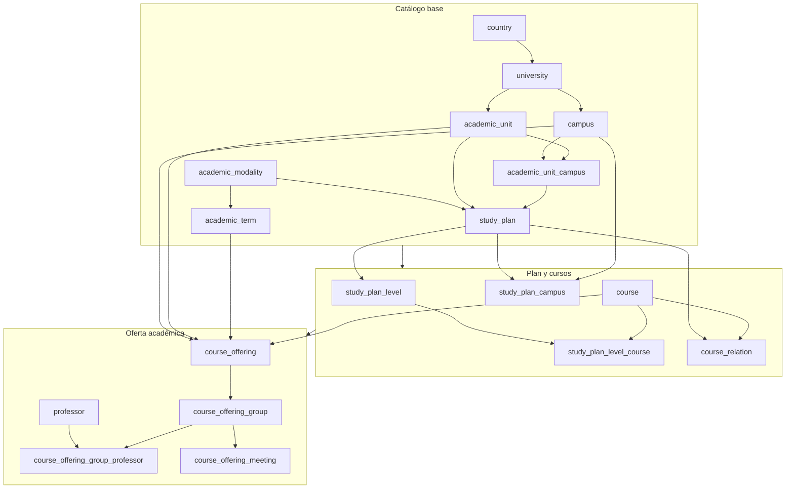

## Grafo de dependencias

El procesamiento de datos respeta el orden de dependencias entre entidades, de
modo que cada entidad necesita que sus referencias estén disponibles antes de
poder generarse.



## Catálogo de entidades

Cada entidad representa una tabla en la base de datos de destino y el pipeline
genera un archivo `data.json` por entidad con los registros normalizados.

### Entidades de catálogo base

**country** es el país de referencia, solo Costa Rica con código ISO `CR`. No
depende de ninguna otra entidad y su ID determinista usa el código ISO.

**university** es la universidad, solo el ITCR. Depende de `country` y su ID se
basa en una constante interna por ser un valor fijo del pipeline.

**campus** son las sedes del TEC. Se obtienen combinando dos fuentes (un JSON
API `carga_sedes_json.json` y un HTML parseado `carga_sedes_tds_lib.html`),
donde el HTML se usa como base por tener más sedes y el JSON aporta nombres más
largos u oficiales donde faltan.

```json title="data/raw/campus/data.json"
[
  {
    "id": 12345,
    "code": "CA",
    "name": "CAMPUS TECNOLOGICO CENTRAL CARTAGO",
    "university_id": 98765,
    "is_active": true
  }
]
```

**academic_unit** son las unidades académicas (escuelas y carreras), cada una
pertenece a una universidad y tiene un código único, y el procesamiento
normaliza nombres a mayúsculas y elimina espacios redundantes.

**academic_unit_campus** es la relación muchos a muchos entre unidades
académicas y sedes que indica qué sedes ofrece cada carrera, y se genera durante
el procesamiento de `academic_unit` a partir de los datos de sedes asociadas a
cada escuela.

**academic_modality** son las modalidades académicas (semestral, trimestral,
etc.) y cada modalidad define cuántos periodos tiene por año (`periods_per_year`);
es una entidad de referencia sin dependencias de catálogo.

**academic_term** es el periodo académico concreto definido por año, modalidad y
número de periodo (por ejemplo, `2025-1-1` para año 2025, modalidad semestral,
primer periodo). Depende de `academic_modality`.

### Entidades de plan de estudios

**study_plan** es el plan de estudios de una carrera. Depende de la unidad
académica y la modalidad, su clave natural combina el código de la unidad y el
`external_plan_id` que viene de la fuente, y el ID determinista se genera con
`deterministic_id("study_plan", unit_code, external_plan_id)`.

**study_plan_campus** son las sedes donde un plan de estudios está disponible,
como relación muchos a muchos entre `study_plan` y `campus` que se genera
durante el procesamiento del plan.

**study_plan_level** son los niveles o bloques dentro de un plan de estudios
(por ejemplo, "I Nivel", "II Nivel" o "Bloque 1"). Cada nivel tiene un número de
orden y una etiqueta textual, y pertenece a un plan específico.

**course** es el catálogo de cursos con código, nombre, créditos por defecto y
horas semanales por defecto. Los cursos se descubren durante el procesamiento de
planes de estudio (cada plan enumera los cursos que lo componen), y el nombre
puede mejorarse después con datos de `schedule_guia`.

**study_plan_level_course** es la asignación de un curso a un nivel dentro de un
plan, con créditos y horas específicas para ese contexto (pueden diferir de los
valores por defecto del curso) e incluye `sort_order` para mantener el orden
esperado dentro del nivel.

**course_relation** son las relaciones entre cursos dentro de un plan de
estudios: prerequisitos, correquisitos y equivalencias. Cada relación tiene un
tipo (`course_relation_type`) y pertenece a un plan específico, porque un mismo
curso puede tener relaciones distintas en diferentes planes.

### Entidades de oferta académica

**professor** son los profesores descubiertos durante el procesamiento de
horarios. La fuente incluye nombres que pueden ser placeholders, por lo que el
pipeline filtra valores como "SIN PROFESOR ASIGNADO", y el ID determinista se
genera con el nombre completo normalizado.

**course_offering** es la oferta de un curso en un periodo, sede y unidad
académica específicos. Incluye `credits_snapshot` y `weekly_hours_snapshot` que
registran los valores del curso al momento de la oferta, y la clave natural
combina `course_id`, `campus_id`, `academic_unit_id` y `academic_term_id`.

```json title="data/raw/course_offering/data.json"
[
  {
    "id": 54321,
    "course_id": 12345,
    "campus_id": 67890,
    "academic_unit_id": 11111,
    "academic_term_id": 22222,
    "credits_snapshot": 4,
    "weekly_hours_snapshot": 5,
    "is_active": true
  }
]
```

**course_offering_group** es el grupo específico de una oferta. Cada grupo tiene
un código (ej. "01", "02"), un tipo normalizado (`group_type`) y una capacidad,
donde el tipo se normaliza desde los valores de la fuente (por ejemplo, "GRUPO
REGULAR" se convierte en `REGULAR`, "GRUPO RN" en `RN`).

**course_offering_group_professor** es la asignación de profesores a un grupo, y
como un grupo puede tener varios profesores el pipeline salta placeholders
durante la asignación.

**course_offering_meeting** son las reuniones de un grupo con día de la semana
(1-7, lunes a domingo), hora de inicio, hora de fin y aula. Las aulas se
normalizan de modo que strings vacíos y "NO DISPONIBLE" se convierten en `NULL`.

## Fuentes externas

Los datos provienen de dos servicios del ITCR. Las APIs de
`tecdigital.tec.ac.cr` entregan el catálogo base con endpoints para sedes,
unidades académicas, periodos, planes de estudio y detalles de cada plan
(cursos, niveles, relaciones), y las respuestas son JSON con estructura variable
según la entidad. Los endpoints de `tec-appsext.itcr.ac.cr/guiahorarios`
entregan la oferta académica y horarios, donde `course_offer` está disponible
como JSON por año y código de escuela y `schedule_guia` está disponible como
HTML por sede, carrera, año, modalidad y periodo (se parsea a JSON durante la
descarga).

## Archivos de salida

Cada entidad produce un archivo `data/raw/{entidad}/data.json` con el siguiente
contenido:

| Archivo                                     | Contenido                                      |
| ------------------------------------------- | ---------------------------------------------- |
| `campus/data.json`                          | Sedes con código, nombre y universidad         |
| `academic_unit/data.json`                   | Unidades académicas con código y nombre        |
| `academic_unit_campus/data.json`            | Relación unidad-sede                           |
| `academic_modality/data.json`               | Modalidades con periodos por año               |
| `academic_term/data.json`                   | Periodos concretos por año, modalidad y número |
| `study_plan/data.json`                      | Planes con unidad, modalidad y ID externo      |
| `study_plan_campus/data.json`               | Sedes donde se ofrece cada plan                |
| `study_plan_level/data.json`                | Niveles por plan                               |
| `course/data.json`                          | Catálogo de cursos                             |
| `study_plan_level_course/data.json`         | Cursos asignados a niveles                     |
| `course_relation/data.json`                 | Relaciones entre cursos por plan               |
| `professor/data.json`                       | Profesores (generado desde horarios)           |
| `course_offering/data.json`                 | Ofertas de cursos por periodo                  |
| `course_offering_group/data.json`           | Grupos de cada oferta                          |
| `course_offering_group_professor/data.json` | Profesores por grupo                           |
| `course_offering_meeting/data.json`         | Reuniones de cada grupo                        |

## IDs deterministas

Los IDs de todas las entidades se generan con la función `deterministic_id()` en
lugar de secuencias autoincrementales, para que el pipeline sea idempotente de
modo que ejecutarlo dos veces con la misma fuente produzca los mismos IDs y los
upserts no creen duplicados. Cuando el comando `sync` se conecta a una base
existente consulta los IDs reales almacenados y prefiere usarlos antes que
generar nuevos, y solo cuando una entidad no existe en la base se genera un ID
determinista nuevo, lo que asegura que las relaciones entre tablas se mantengan
aunque el pipeline se ejecute múltiples veces contra el mismo entorno.

## Transformaciones de calidad de datos

El pipeline aplica varias normalizaciones para garantizar consistencia. Los
textos se normalizan a mayúsculas y sin espacios redundantes mediante
`normalize_text()`, y los caracteres acentuados se reemplazan por sus
equivalentes ASCII mediante `remove_accents()` para mantener compatibilidad con
los enums de la base de datos.

Los tipos de grupo pasan por `normalize_group_type()`, que elimina el prefijo
"GRUPO " y valida contra los valores conocidos; si aparece un tipo nuevo el
pipeline lanza un error con los archivos afectados para que se agregue al mapa
de normalización.

Los nombres de profesor se filtran con `is_placeholder_professor_name()` para
excluir valores como "SIN PROFESOR ASIGNADO" o "(SE IMPARTE EN IDIOMA INGLES)",
evitando así poblar la tabla `professor` con registros que no representan
personas reales.

Las aulas se normalizan con `normalize_classroom()`, de modo que valores vacíos
o "NO DISPONIBLE" se convierten en `NULL` y el resto se conserva tal cual.

Los créditos y horas semanales de la oferta priorizan los valores de
`course_offer` (la fuente más específica para ese dato) y, si no están
disponibles, se usan los valores por defecto del catálogo de cursos.
