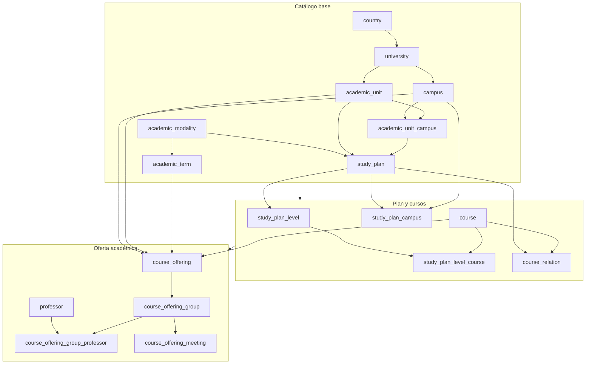

Cada entidad sincronizada produce un archivo `data/raw/{entidad}/data.json`. El
orden de procesamiento importa porque varias entidades contienen llaves foráneas
que se resuelven con datos ya normalizados.

## Grafo de dependencias

## Scopes y tablas

| Scope | Tablas |
| --- | --- |
| `catalog` | `country`, `university`, `campus`, `academic_unit`, `academic_modality`, `academic_term`, `academic_unit_campus`, `study_plan`, `study_plan_campus`, `study_plan_level`, `course`, `study_plan_level_course`, `course_relation`, `professor` |
| `offering` | `professor`, `course_offering`, `course_offering_group`, `course_offering_group_professor`, `course_offering_meeting` |
| `all` | Todas las tablas anteriores |

`offering` incluye `professor` porque los profesores se descubren durante el
procesamiento de horarios. Aun así, necesita que el catálogo ya exista para poder
resolver cursos, sedes, unidades y periodos.

## Entidades de catálogo

**country** contiene el país de referencia, actualmente Costa Rica (`CR`).

**university** contiene la institución (`ITCR`) y depende de `country`.

**campus** contiene sedes. Su clave natural es `code`; la fuente combina listados
de sedes del TEC para obtener cobertura y nombres consistentes.

**academic_unit** contiene escuelas/departamentos/carreras con código único por
universidad.

**academic_unit_campus** relaciona unidades académicas con sedes. Se genera al
procesar unidades académicas y sirve como insumo para descargar planes por
combinación sede-unidad.

**academic_modality** contiene modalidades como semestre, bimestre, trimestre,
mensual o verano. Define `periods_per_year`.

**academic_term** representa un periodo concreto. Su clave natural es
`external_key`, con formato real como `2026_S_1`, `2026_V_1` o `2026_M_12`.

## Entidades de plan

**study_plan** depende de `academic_unit` y `academic_modality`. Su clave natural
es `(academic_unit_id, external_plan_id)`; `external_plan_id` proviene del sistema
de curricula del TEC.

**study_plan_campus** indica en qué sedes está disponible un plan. Su clave es
`(study_plan_id, campus_id)`.

**study_plan_level** representa niveles o bloques dentro del plan. Su clave es
`(study_plan_id, level_number)`.

**course** es el catálogo canónico de cursos, con `code`, `name`,
`default_credits` y `default_weekly_hours`. El nombre puede completarse luego con
datos de horarios si el plan solo traía el código.

**study_plan_level_course** relaciona cursos con niveles y guarda créditos, horas
y `sort_order` del curso dentro de ese plan.

**course_relation** contiene prerequisitos, correquisitos y equivalencias dentro
de un plan. Sus tipos válidos son `PREREQUISITE`, `COREQUISITE` y `EQUIVALENT`.

## Entidades de oferta

**professor** contiene nombres de profesores descubiertos en horarios. El pipeline
filtra placeholders como `SIN PROFESOR ASIGNADO`.

**course_offering** es la oferta de un curso para una sede, unidad y periodo. Su
clave natural es `(course_id, campus_id, academic_unit_id, academic_term_id)` y
guarda snapshots de créditos, horas y tipo de materia.

**course_offering_group** representa un grupo. Su clave natural es
`(course_offering_id, group_code)` y contiene `group_type` y `capacity`.

**course_offering_group_professor** asigna profesores a grupos con clave
`(course_offering_group_id, professor_id)`.

**course_offering_meeting** contiene reuniones de grupo con `weekday`,
`starts_at`, `ends_at` y `classroom`. Su clave natural es
`(course_offering_group_id, weekday, starts_at, ends_at)`.

## Llaves naturales e IDs

Los archivos procesados pueden traer IDs locales temporales, pero `sync` no los
aplica ciegamente. Antes de generar el delta, consulta la base destino por llaves
naturales, reutiliza IDs existentes cuando hay match y asigna nuevos IDs
secuenciales cuando no existe la fila. Esto mantiene estables las referencias ya
persistidas y permite que la base haya sido reindexada sin romper el pipeline.

La migración de reindexado compacto actualizó las tablas TEC y habilitó cascadas
necesarias para que FKs como evaluaciones y tablas dependientes conservaran
integridad. Por eso la documentación debe tratar el ID como PK interna y la llave
natural como contrato de sincronización.

## Lifecycle de datos sincronizados

Las tablas sync-managed usan lifecycle lógico:

| Columna | Uso |
| --- | --- |
| `is_active` | Indica si la fila sigue vigente en la fuente sincronizada. |
| `updated_at` | Marca actualizaciones y reactiva filas sincronizadas. |
| `deactivated_at` | Guarda cuando una fila dejó de aparecer en la fuente. |

El sync no elimina físicamente catálogo ni oferta. Si una fila deja de aparecer,
se marca inactiva para no romper historial, horarios guardados, evaluaciones o
reseñas que todavía dependan de ella.

Para oferta, los soft deletes se acotan a los términos sincronizados. Una corrida
`--scope offering --years 2026` no debe desactivar oferta de otros años.

## Valores controlados

`group_type` acepta actualmente estos valores:

| Valor |
| --- |
| `REGULAR` |
| `SEMIPRESENCIAL` |
| `VIRTUAL` |
| `ASISTIDA` |
| `TUTORIA` |
| `LABORATORIO` |
| `RN` |
| `ENSEÑANZA REMOTA` |
| `TRABAJO FINAL DE GRADUACIÓN` |
| `TALLER` |

El procesador normaliza alias externos: `PRESENCIAL` pasa a `REGULAR`, `GRUPO RN`
pasa a `RN`, variantes sin acento de enseñanza remota y TFG pasan a sus valores
canónicos. Si aparece un tipo desconocido, el proceso falla con ejemplos para
agregar primero el valor al enum/mapeo.

## Archivos de salida

| Archivo | Contenido |
| --- | --- |
| `country/data.json` | País de referencia. |
| `university/data.json` | Institución. |
| `campus/data.json` | Sedes con código y nombre. |
| `academic_unit/data.json` | Unidades académicas. |
| `academic_unit_campus/data.json` | Relación unidad-sede. |
| `academic_modality/data.json` | Modalidades académicas. |
| `academic_term/data.json` | Periodos por año, modalidad y número. |
| `study_plan/data.json` | Planes de estudio. |
| `study_plan_campus/data.json` | Sedes donde se ofrece cada plan. |
| `study_plan_level/data.json` | Niveles del plan. |
| `course/data.json` | Catálogo de cursos. |
| `study_plan_level_course/data.json` | Cursos por nivel. |
| `course_relation/data.json` | Prerequisitos, correquisitos y equivalencias. |
| `professor/data.json` | Profesores descubiertos en horarios. |
| `course_offering/data.json` | Ofertas por curso/sede/unidad/periodo. |
| `course_offering_group/data.json` | Grupos de cada oferta. |
| `course_offering_group_professor/data.json` | Profesores por grupo. |
| `course_offering_meeting/data.json` | Reuniones de grupo. |

## Tablas operativas relacionadas

`sync_seed_run` no representa una entidad académica del TEC. Es el ledger de
sincronización: registra seeds generados/aplicados, hash, scope, años, términos,
estado y metadata.

`schedule_equivalence_placeholder_course` configura placeholders de equivalencia
para el planificador de horarios. Depende conceptualmente de códigos de curso,
aunque no forma parte del pipeline base de descarga del TEC.
